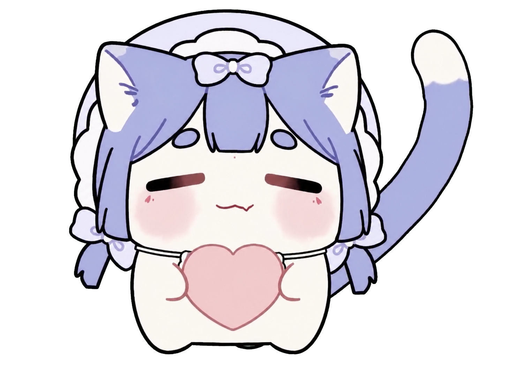
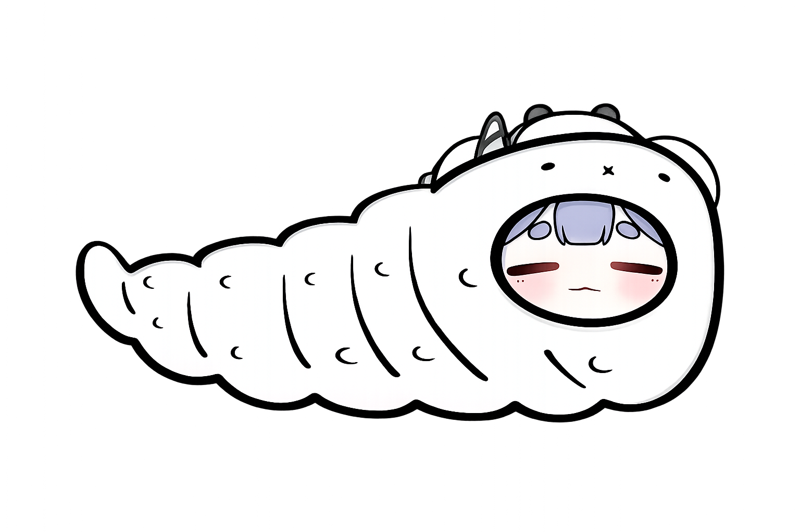
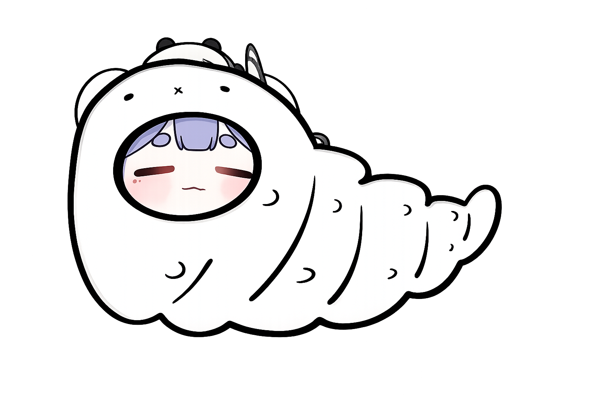
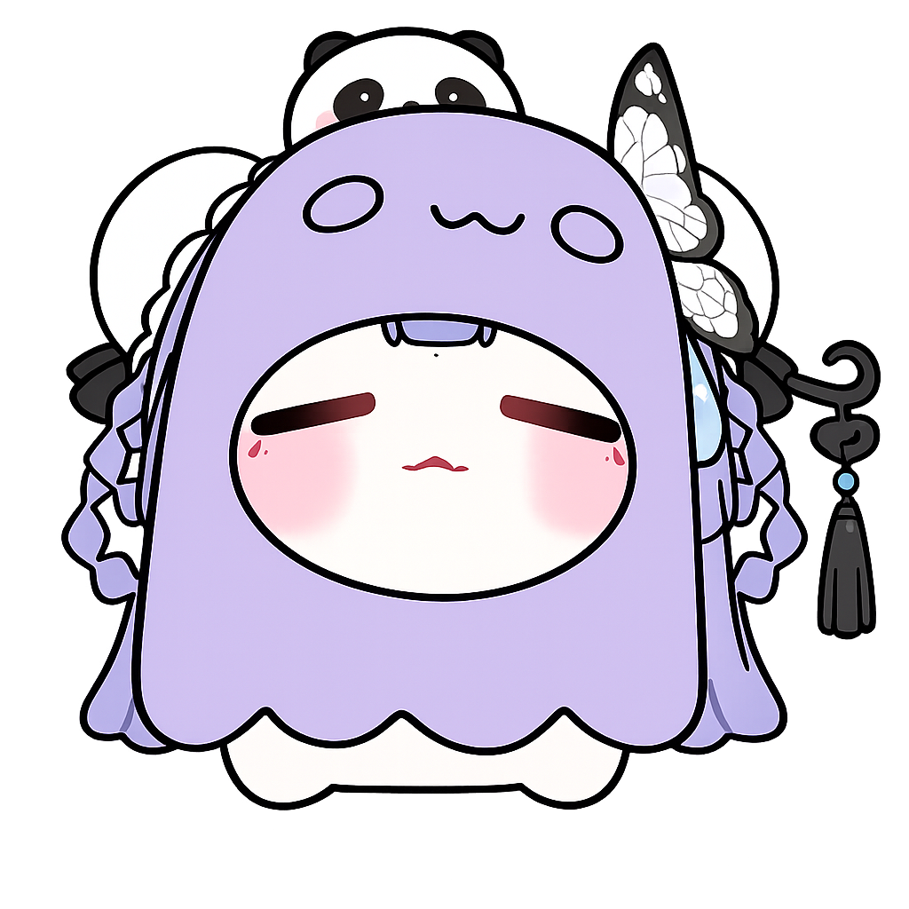

# 坨梓 Codex Pet

<p align="center">
  
  
  
</p>

<p align="center">
  
</p>

<p align="center">
  一只会随着 Codex 工作状态更换装扮的虚拟主播风格桌面宠物。
</p>

## 关于坨梓

坨梓是一只为 Codex 制作的自定义 v2 动画宠物，其角色形象来自 Bilibili UP 主[「阿梓从小就很可爱」](https://space.bilibili.com/7706705)。她会根据休息、移动、工作、等待和失败等状态切换不同的皮套与动作，但始终保留标志性的淡紫色长发、蝴蝶头饰、闭眼表情和软乎乎的正面形象。

整体动画采用克制的微动作：脸部只做很小幅度的移动，不会突然转向，也不会把眼睛改成睁开，以保留虚拟主播皮套般安静、可爱的观感。

> 本页展示的均为静态 PNG 角色图；Codex 中的实际动画由 `spritesheet.webp` 播放。

## 项目特点

- **状态换装**：每个 Codex 状态都有对应造型，而不是重复使用同一套动作。
- **形象一致**：所有动画保持闭眼、正面构图与淡紫色系，不改变坨梓的核心特征。
- **微动作设计**：动作幅度克制，强调软乎乎、安静且可爱的桌面陪伴感。
- **开箱即用**：发布包仅包含 `pet.json` 和 `spritesheet.webp`，可直接安装到 Codex。

## 状态展示

<table>
  <tr>
    <td align="center" width="50%">
      <br>
      <strong>Idle · 猫猫形态</strong><br>
      默认休息状态。猫耳轻轻微动，长尾缓慢左右摆动；面部保持正对屏幕和困倦的闭眼表情。
    </td>
    <td align="center" width="50%">
      <br>
      <strong>Jumping · 抱爱心</strong><br>
      抱着粉色爱心的猫猫坨梓，配合轻柔的尾巴摆动，表达开心与互动反馈。
    </td>
  </tr>
  <tr>
    <td align="center" width="50%">
      <br>
      <strong>Running Right · 区宝宝</strong><br>
      向右移动时切换为区宝宝形态，通过身体非常轻微的蠕动表现移动感。
    </td>
    <td align="center" width="50%">
      <br>
      <strong>Running Left · 区宝宝</strong><br>
      向左移动时使用对应方向的区宝宝形态，保持相同的柔和蠕动节奏。
    </td>
  </tr>
  <tr>
    <td align="center" width="50%">
      <br>
      <strong>Waving · 美人鱼</strong><br>
      打招呼或吸引注意时换上美人鱼装扮，以轻微的上下起伏表现挥手状态。
    </td>
    <td align="center" width="50%">
      <br>
      <strong>Failed · 幽灵</strong><br>
      任务失败、取消或受阻时披上幽灵服，身体小幅左右摇摆，传达失落但不失可爱的情绪。
    </td>
  </tr>
  <tr>
    <td align="center" width="50%">
      <br>
      <strong>Waiting · 乞讨</strong><br>
      等待审批、帮助或用户输入时换上乞讨服，双手与手中的碗轻轻上下移动。
    </td>
    <td align="center" width="50%">
      <br>
      <strong>Running · 唱歌</strong><br>
      Codex 正在处理任务时进入唱歌形态，嘴巴随节奏开合，麦克风也会轻微移动。
    </td>
  </tr>
</table>

## 技术规格

| 项目 | 规格 |
| --- | --- |
| Codex 宠物版本 | v2（`spriteVersionNumber: 2`） |
| 精灵图格式 | WebP，透明背景 |
| 精灵图尺寸 | `1536 × 2288` |
| 网格 | `8 × 11` |
| 单格尺寸 | `192 × 208` |
| 标准状态 | 9 个动画行 |
| 方向响应 | 16 个方向注视帧 |

除上方展示的八种造型外，精灵图中还包含 `review` 状态和完整的方向注视帧；它们未在本页使用额外静态图展示。

## 安装

### 从 Releases 安装（推荐）

1. 前往 [Releases](https://github.com/Kuang-Long/codex-pet-tuozi/releases/latest) 下载最新的 `tuozi.zip`。
2. 解压后会得到一个 `tuozi` 文件夹。
3. 将整个 `tuozi` 文件夹复制到 `~/.codex/pets/`。

在 macOS 或 Linux 上，可以在下载目录中运行：

```bash
unzip tuozi.zip
mkdir -p ~/.codex/pets
cp -R ./tuozi ~/.codex/pets/
```

如果本机已经安装过同名宠物，请先备份原目录，再执行复制。

安装完成后的目录应为：

```text
~/.codex/pets/tuozi/
├── pet.json
└── spritesheet.webp
```

随后重新打开 Codex，或重新选择一次宠物，让应用加载新的资源。安装后请确认 `pet.json` 与 `spritesheet.webp` 位于同一个 `tuozi` 目录中。

## 发布结构

```text
.
├── README.md
├── assets/
│   └── showcase/            # README 使用的静态 PNG 展示图
└── final/
    └── package/tuozi/       # 可直接发布和安装的宠物包
```

使用者只需下载 `final/package/tuozi/` 即可安装。

## 角色来源与版权声明

- **角色来源**：本项目中的 Codex 宠物形象来自 Bilibili UP 主[「阿梓从小就很可爱」](https://space.bilibili.com/7706705)。
- 本仓库未声明对原角色形象、角色设定或相关美术素材的所有权。
- 原角色形象及相关素材的权利归原作者和相应权利人所有。
- 转载、修改、二次分发或用于商业用途前，请先取得相应授权。
